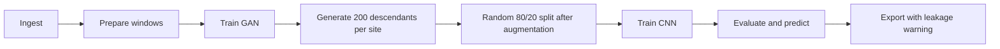

# End-to-end reconstruction workflow

Two workflows share the same implementation components but differ in when original sites
are assigned to train, validation, and test partitions.

## Leakage-safe workflow

```mermaid
flowchart LR
    A["Ingest authorized rasters and sites"] --> B["Validate and extract 32x32 windows"]
    B --> C["Split original site groups"]
    C --> D["Fit training-only normalization and GAN"]
    D --> E["Generate synthetic descendants"]
    E --> F["Validate augmentation with PSNR and review panels"]
    F --> G["Train prospectivity CNN"]
    G --> H["Evaluate untouched groups and spatial test area"]
    H --> I["Run full-area sliding-window inference"]
    I --> J["Export confidential rasters and redacted summary"]
```



## Paper-faithful workflow

The historical reconstruction moves splitting after augmentation. It is retained only for
comparison with the publication and must be labeled as vulnerable to group leakage.



## Stage contracts

| Stage | Input | Main output |
| --- | --- | --- |
| `ingest` | Local manifest and authorized files | Feature cube and labeled-site references |
| `prepare` | Feature cube and sites | Validated site windows and preprocessing state |
| `split` | Original or augmented windows | Immutable split manifest with `group_id` |
| `train_gan` | Eligible real windows | Generator/discriminator checkpoints |
| `augment` | Generator and original windows | Synthetic windows with parent group IDs |
| `validate_augmentation` | Real and synthetic pairs | PSNR distribution and review panels |
| `train_classifier` | Training windows | CNN checkpoint and learning history |
| `evaluate` | Untouched validation/test data | Aggregate metrics and calibration report |
| `predict` | Full cube, preprocessing state, CNN | Cell-level prospectivity grid |
| `export` | Metrics and grid | Confidential outputs plus public redacted summary |

## Confidentiality boundary

Pipeline stages exchange `ArtifactRef` objects instead of copying raw arrays into manifests.
Private manifests may contain local artifact locations and are written only under ignored
output directories. Public manifests redact locations, checksums, errors, and non-approved
metadata for confidential artifacts.

The local backend is injected through a `module:function` factory. This keeps confidential
reader logic and path configuration outside the public package while preserving a stable,
testable workflow interface.

`InMemoryResearchBackend` provides the complete computational reference implementation:
it connects preparation, policy-specific splitting, GAN training, augmentation, PSNR,
classifier training, evaluation, sliding-window prediction, and export summaries. A future
local backend only needs to replace confidential ingest and geospatial file export, or
delegate all intermediate stages to this reference backend.

## CLI shape

Resolve either workflow without touching data:

```bash
python -m ree_prospectivity plan --config configs/leakage_safe.toml
```

Execute through a specific stage once a local backend exists:

```bash
python -m ree_prospectivity run \
  --config configs/leakage_safe.toml \
  --backend-factory local_backend:create_backend \
  --run-id experiment-001 \
  --run-directory outputs/experiment-001 \
  --target evaluate
```

The public repository will not include `local_backend.py`, local manifests, or outputs.
